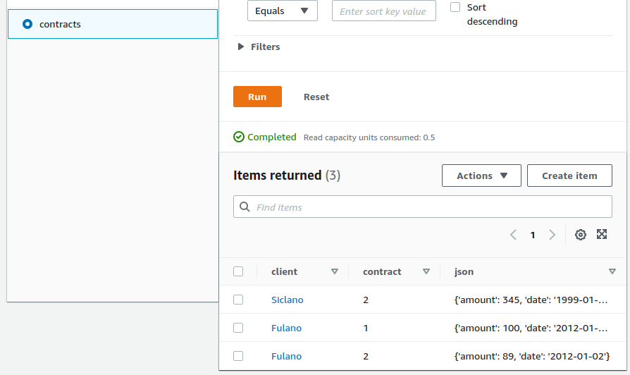

Rodar no terminal com o comando abaixo

```
mvn package

spark-submit --packages com.audienceproject:spark-dynamodb_2.12:1.1.2 --master local --class com.fabiogouw.tableloader.LoaderApp target/tableloader-1.0-SNAPSHOT.jar src/main/resources/sample.csv
```
O resultado do arquivo é carregado no DynamoDB

